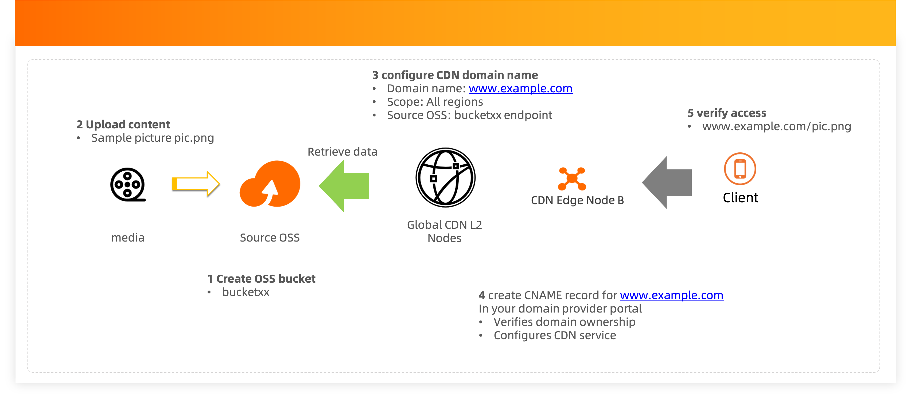

# OSS Lab 4 ###  Content Distribution using CDN and OSS

##  Description
OSS integrates with CDN products to deliver reliable, scalable, flexible and cost effective content distribution solutions For media related use cases, content needs to be processed before it goes to the end user. For example, resize, rotate, or add water mark.

You might need content distribution solution when you build:
###  E### commerce platform
###  Social media
###  Video on demand
###  App Store
## Architecture
The Terraform script does the following things as shown in the architecture diagram:

 


### 1. Create OSS bucket for backend storage
```
resource "alicloud_oss_bucket" "source_bucket" {
  bucket = var.bucket_name
  acl    = "private"
}

resource "alicloud_oss_bucket_object" "testpic" {
  bucket = "${alicloud_oss_bucket.source_bucket.bucket}"
  key = var.source_key
  source = "images/architecture.png"
  acl    = "public### read"
}
```
### 2. Create CDN bucket

```
resource "alicloud_cdn_domain_new" "cdn_1" {
  cdn_type          = "video"
  domain_name       = var.domain_name
  scope             = var.scope
  tags              = {}

  certificate_config {
    cert_type                 = "free"
    server_certificate_status = "off"
  }

  sources {
    content  = "${alicloud_oss_bucket.source_bucket.bucket}.${alicloud_oss_bucket.source_bucket.extranet_endpoint}"
    port     = 80
    priority = 20
    type     = "oss"
    weight   = 10
  }
}

```

## Steps to deploy
  install terraform on your local machine
### Run terraform initialization
```
terraform init 
```
### Preview the deployment
```
> terraform plan ### var name="<your bucket name>"
```
The command will output resources that are to be created and output otf the script
### Execute the deployment 
```
> terraform apply ### var bucket_name="<your bucket name>" ### auto### approve
```
The script will run for about 1 ～ 5 minutes and output necessary information for testing. 

### Configure CDN domain name
Go to CDN console, and follow the instruction to verify your domain ownership and config necessary DNS records. 
  
### Verify
Open your browser and navigate to "example.com/testpic.png" to verify the content can be accessed from CDN.

### Destroy POC resources
  
Manully delete all the objects in the oss bucket and then run the following:
```
> terraform destropy ### var name="<your bucket name>" ### auto### approve
```