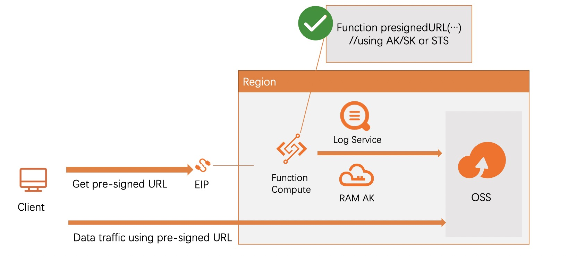

# OSS Lab 3 - Direct OSS Access using presigned url

##  Description
OSS offers large bandwidth and free ingress. Therefore, an application should directly perform file operation against OSS. Similar to database access, accessing OSS requires the client to provide its credential to authenticate in forms an access key and a signature, which is a canonicalized request signed by a secret key. A common mistake for web developer is to embed the access key and secret key in the client code, leaking the secret will causes catastrophic security issue. 

A better way is to keep your secret key in your application server and the client get a temporary access url or token with a restricted scope after authenticating with the application server. 

See more information on help....

## Architecture
The Terraform script does the following things as shown in the architecture diagram:

 


### 1. Create OSS bucket for backend storage
```
resource "alicloud_oss_bucket" "default" {
  bucket = var.bucketname
  acl = "private"
}

```

### 2. Create RAM AK and grant necessary permission to access the OSS bucket

```

resource "alicloud_ram_user" "user" {
  name         = "oss_access_${var.bucketname}"
  display_name = "fc access bucket ${var.bucketname}"
}

resource "alicloud_ram_access_key" "ak" {
  user_name   = alicloud_ram_user.user.name
}

resource "alicloud_ram_policy" "fc_access_oss_policy" {
  policy_name        = "fc_access_${var.bucketname}"
  policy_document    = <<EOF
  {
    "Statement": [
      {
        "Action": [
          "oss:ListObjects",
          "oss:GetObject",
          "oss:PUTObject"
        ],
        "Effect": "Allow",
        "Resource": [
          "acs:oss:*:*:${alicloud_oss_bucket.default.id}",
          "acs:oss:*:*:${alicloud_oss_bucket.default.id}/*"
        ]
      }
    ],
      "Version": "1"
  }
  EOF
  description = "Allow Object Operation for bucket ${alicloud_oss_bucket.default.id}"
  force       = true
}

```

### 3. Create Function Compute Service to generated presigned URL
```
resource "alicloud_fc_function" "default" {
  service     = alicloud_fc_service.default.name
  name        = var.name
  description = "tf"
  filename = "./getpresignedurl-code.zip"
  memory_size = "512"
  runtime     = "nodejs12"
  handler     = "index.handler"
  environment_variables = {
    ak = alicloud_ram_access_key.ak.id
    sk = alicloud_ram_access_key.ak.secret
    bucketname = alicloud_oss_bucket.default.id
    endpoint =  alicloud_oss_bucket.default.extranet_endpoint
  }
}

resource "alicloud_fc_trigger" "default" {
  service    = "${alicloud_fc_service.default.name}"
  function   = "${alicloud_fc_function.default.name}"
  name       = "${var.name}"
  type       = "http"
  config     =  local.http_trigger_conf
}

resource "alicloud_ram_user_policy_attachment" "attach" {
  policy_name = alicloud_ram_policy.fc_access_oss_policy.name
  policy_type = alicloud_ram_policy.fc_access_oss_policy.type
  user_name   = alicloud_ram_user.user.name
}

```

The function compute contains the sample code to generate the presigned URL. Refer to the help document which explains how it works. 

## Steps to deploy
- install terraform on your local machine
###  Run terraform initialization
```
terraform init 
```
###  Preview the deployment
```
> terraform plan -var name="<your bucket name>"
```
The command will output resources that are to be created and output otf the script
###  Execute the deployment 
```
> terraform apply -var name="<your bucket name>" -auto-approve
```
The script will run for about 1 minutes and you will see fc_demo_url in the output, which would be called by the client code.
###  Test with the client code

Navigate to the folder where you save client.js, modify the code to fc_demo_url to call the function compute. Then run the following command from terminal. You should be able to see similar output.

```
> node client.js

file name? a.txt
file content?hello world
Status Code: 200
presigned url from server: http://xxxxx.oss-cn-hangzhou.aliyuncs.com/a.txt?OSSAccessKeyId=xxxxx&Expires=1643099165&Signature=xxxxxxx
uploaded using presigned url
Status Code: 200
```


- Destroy POC resources
  
Manully delete all the objects in the oss bucket and then run the following:
```
> terraform destropy -var name="<your bucket name>" -auto-approve
```