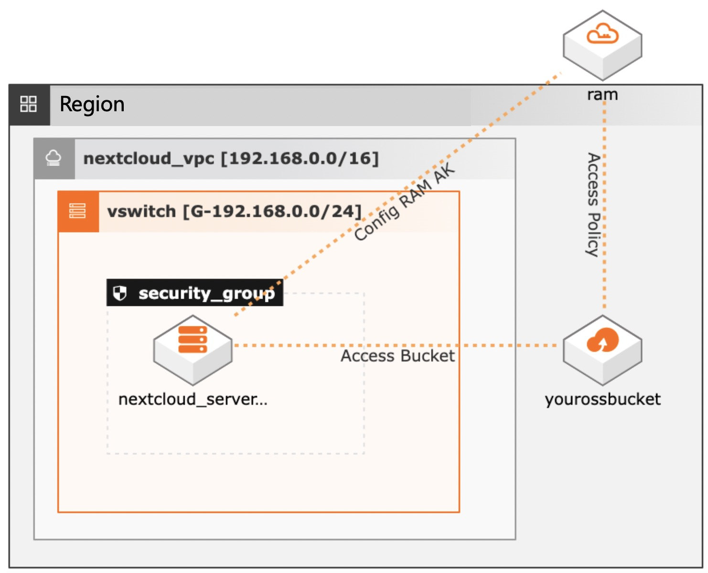
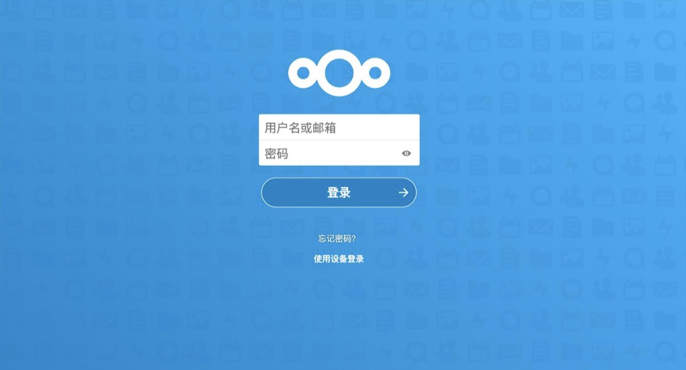

# OSS Lab 1 - Using OSS as primary storage for NextCloud

##  Description
NextCloud is a popular opensource cloud disk solution. Leveraging Object Storage on Alibaba cloud, NextCloud can offer scalabe and cost effective online disk to enterprise customers. This guide uses Terraform as an example to deploy NextCloud on Alibaba Cloud. 

## Architecture
The Terraform script does the following things as shown in the architecture diagram:




### 1. Create OSS bucket for backend storage
```
resource "alicloud_oss_bucket" "default" {
  bucket = var.name
  acl = "private"
  versioning {
    status = "Suspended"
  }
}
```
### 2. Create RAM AK and grant necessary permission to access the OSS bucket

```
resource "alicloud_ram_user" "user" {
  name         = var.ram_user_name
  display_name = "nextcloud user name"
}

resource "alicloud_ram_access_key" "ak" {
  user_name   = alicloud_ram_user.user.name
}

resource "alicloud_ram_user_policy_attachment" "attach" {
  policy_name = "AliyunOSSFullAccess"
  policy_type = "System"
  user_name   = alicloud_ram_user.user.name
}

```

### 3. Create ECS and necessary network components 
```
resource "alicloud_instance" "instance" {
  image_id          = "ubuntu_20_04_x64_20G_alibase_20211123.vhd"
  vswitch_id        =  alicloud_vswitch.default.id
  security_groups   = [alicloud_security_group.group.id]
  instance_type              = "ecs.n4.large"

  availability_zone = data.alicloud_zones.default.zones[0].id
  system_disk_category       = "cloud_efficiency"
  system_disk_name           = "nextcloud_server_systemdisk"
  system_disk_description    = "nextcloud_server_systemdisk"
  instance_name              = var.instance_name
  password                   = var.password
  host_name                  = "nextcloud01"
  tags = {
    "used for" : "next cloud poc"
    "oss backend" : "${alicloud_oss_bucket.default.id}"
  }
}

```

### 4. Config NextCloud 
The script upload the bootstrap bash script to the ECS instance and runs the command. 
```
# Upload deploy script
resource "null_resource" "file" {
  provisioner "file" {
    source      = "nc.sh"
    destination = "/tmp/nc.sh"
    connection {
      type     = "ssh"
      user     = "root"
      password = var.password
      host     = alicloud_eip_address.eip.ip_address
    }
  }
  depends_on = [alicloud_eip_association.eip_asso]
}
#deploy nextcloud
resource "null_resource" "remote" {
  provisioner "remote-exec" {
    connection {
      type     = "ssh"
      user     = "root"
      password = var.password
      host     = alicloud_eip_address.eip.ip_address
    }
    inline = [
      "chmod +x /tmp/nc.sh",
      "/tmp/nc.sh ${alicloud_eip_address.eip.ip_address}  ${var.password}  ${alicloud_ram_access_key.ak.id}  ${alicloud_ram_access_key.ak.secret}  ${alicloud_oss_bucket.default.id}  ${alicloud_oss_bucket.default.intranet_endpoint}",
    ]
  }
  depends_on = [null_resource.file,alicloud_oss_bucket.default]
}
```
The acutally configuration script is in nc.sh file. To run this demo you do not need to change the script.


## Steps to deploy
###  install terraform on your local machine
###  Run terraform initialization
```
terraform init 
```
###  Preview the deployment
```
> terraform plan -var name="<your bucket name>"
```
The command will output resources that are to be created and output otf the script
###  Execute the deployment 
```
> terraform apply -var name="<your bucket name>" -auto-approve
```
The script will run for about 10 minutes and output necessary information for testing. At the end of the execution, you should be seeing the following output:" 
###  Test with the output
Open your browser and navigate to "nextcloud_ip" in the output, which is the public IP address for your nextcloud server.

## Destroy POC resources
  
Manully delete all the objects in the oss bucket and then run the following:
```
> terraform destropy -var name="<your bucket name>" -auto-approve
```